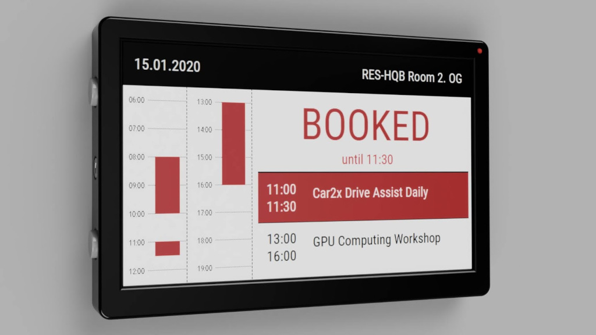

# SmartSign
A battery powered e-Paper sign for conference rooms.

## Device-Frame
The shell components are optimized for FDM printing in PLA with 0.2 mm layer height.

STL-files:
* [Backplate.stl](stl_files/Backplate.stl)
* [ButtonSpacer.stl](stl_files/ButtonSpacer.stl)
* [Frame.stl](stl_files/Frame.stl)
* [Inlay.stl](stl_files/Inlay.stl)

## Elektronics
The hardware is based on of the shelf components and requires no custom PCB designs:
* DFRobot FireBeetle ESP32 IOT Microcontroller
* Waveshare 7.5inch e-Paper B V1 (640x384)
* 3000 mAh LiPo Battery
* RFID RC522 Reader
* Mechanical endstop to wake ESP when card is inserted
* 3mm red LED with 47µF Capacitor and N-Channel FET to keep LED state when ESP is in deep sleep
* 2x tactile switch buttons (12x12x7.3mm)
* Resistors: 1x 330 Ohm, 3x 22K-Ohm, 1x 32K-Ohm, 2x 100K-Ohm

How the components are interconnected, is documented here: [SmartSign Schematic.pdf](docs/SmartSign%20Schematic.pdf)

## Firmware
The firmware is written in C++ and based on PlatformIO. Before you can build the project, you have to create a settings file by renaming the file `.\lib\SmartSign\GlobalSettings.h.default` to `.\lib\SmartSign\GlobalSettings.h`. 

In `GlobalSettings.h` change the `ADMIN_CARD_ID` value to match the id of the your smartcard you want to use to enter the administration mode. All other parameters in this file are default values and can be changed during runtime in the setup mode via web-interface.

