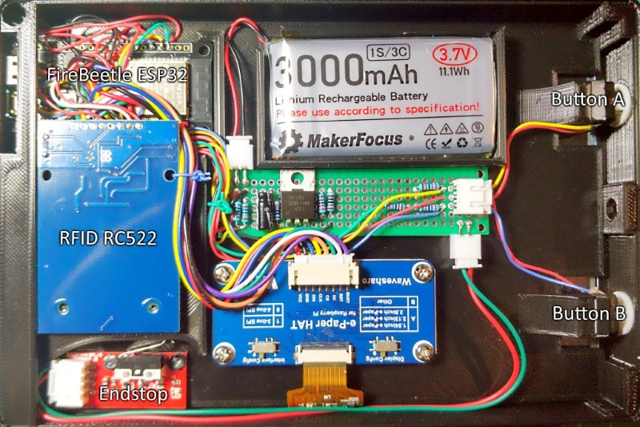
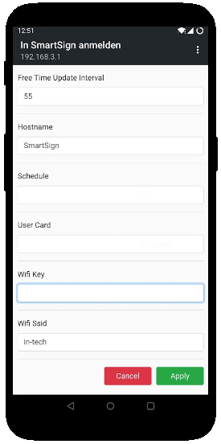

# SmartSign
A battery powered e-Paper sign for conference rooms.

## Device-Frame
The shell components are optimized for FDM printing in PLA with 0.2 mm layer height.

STL-files:
* [Backplate.stl](stl_files/Backplate.stl)
* [ButtonSpacer.stl](stl_files/ButtonSpacer.stl)
* [Frame.stl](stl_files/Frame.stl)
* [Inlay.stl](stl_files/Inlay.stl)

## Electronics
The hardware is based on of the shelf components and requires no custom PCB designs:
* DFRobot FireBeetle ESP32 IOT Microcontroller
* Waveshare 7.5inch e-Paper B V1 (640x384)
* 3000 mAh LiPo Battery
* RFID RC522 Reader to read Mifare S50 keycards for administration and authorization
* Mechanical endstop to wake ESP when card is inserted
* 3mm red LED with 47µF Capacitor and N-Channel FET to keep LED state when ESP is in deep sleep
* 2x tactile switch buttons (12x12x7.3mm)
* Resistors: 1x 330 Ohm, 3x 22K-Ohm, 1x 32K-Ohm, 2x 100K-Ohm
  

How the components are interconnected, is documented here: [smartsign_schematic.pdf](docs/smartsign_schematic.pdf)

## Firmware
The firmware is written in C++ and based on PlatformIO. Before you can build the project, you have to create a settings file by renaming the file [`.\lib\SmartSign\GlobalSettings.h.default`](lib/SmartSign/GlobalSettings.h.default) to `.\lib\SmartSign\GlobalSettings.h`. 

In `GlobalSettings.h` change the `ADMIN_CARD_ID` value to match the id of the keycard you want to use to enter the administration mode. All other parameters in this file are default values and can be changed during runtime in the setup mode via web-interface.

## Administration-Mode
You can enter the administration mode, by inserting the **administration keycard** into the cardslot:

The administration screen provides information about the current battery voltage, WiFi status and NTP time. When the battery voltage falls below 3.6 volt you should consider recharging the device.

## Setup-Mode
You can enter the setup mode by pressing button B in the administration mode. In this mode, the SmartSign creates a temporary WiFi hotspot with a random name and random password. Whe connecting to this WiFi with your smartphone or computer, you gain access to a property page where you can change the settings specified in [`.\lib\SmartSign\GlobalSettings.h`](lib/SmartSign/GlobalSettings.h.default). The most important settings are the WiFi credentials, the name of the schedule and the Azure client and tenant ids (more on this [here](https://docs.microsoft.com/en-us/graph/tutorials/dotnet-core?view=graph-rest-beta&tutorial-step=2)). 

## Authorization-Mode
Before the SmartSign can show schedules of your outlook calendar, you have to authorize the device to access you calendar. You can enter the authorization mode from the administration mode by pressing button A. Another way to enter the authorization mode is to insert a card that is dedicated to enter this mode. You can configure this option by setting the **User Card** in the setup mode.

